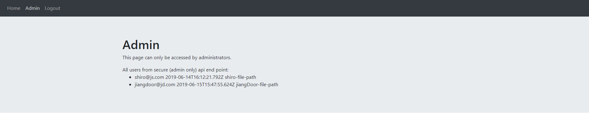

# Simple Web IDE: 简单的Web端IDE实现


## **项目地址**

[webIDE-frontend](https://github.com/HhhuYu/webIDE_frontend)

[webIDE-backend](https://github.com/HhhuYu/webIDE_backend)


## **运行**

需要预装mongodb

```bash
# frontend
git clone git@github.com:HhhuYu/webIDE_frontend.git

# 解压

# 安装第三方包
npm install

# 启动
ng serve --open
http://localhost:4200/
```

```bash
# backend
git clone git@github.com:HhhuYu/webIDE_backend.git

# 解压

# 安装第三方包
npm install

# 启动
npm start
http://localhost:3000/
```


## **页面展示**

- 登录
  - 

- 注册
  - 

- 主页
  - 

- 简单管理员
  - 

## **主要功能**

- 登录与注册
  - 使用mongoose操作mongodb，存储用户信息
    - 
  - 使用jwt做用户鉴权
  - 这个功能放在一台服务器上 
  - 注册玩用户会自动建立用户目录
- 对用户内部文件增删改查
  - 用户可以操作他空间的所有文件。
- 伪shell交互
  - 使用websocket
- 文件内容编辑
  - 可以识别文件，提供不一样的语言环境。


## **前端模块依赖**

- `@angualr/*`: 属于angular本身提供的一些运行包，介绍一些重要的包。
  - `router`: 路由
  - `http`: http 请求
  - `forms`: forms 表单
  - `compiler`: 编译
- `ace-builds`: editor 组件
- `bootstrap`: bootstrap css组件库
- `core-js`: JavaScript的模块化标准库
- `font-awesome`: 字体和CSS框架
- `lodash.isequal`: lodash 中的 isequal模块
- `ngx-tree-dnd`: 文件树 组件
- `rxjs`: 响应式模块
- `tslib`: TypeScript的运行时库
- `zone.js`: zone是在异步任务中持续存在的执行上下文。
- `ngx-socket-io`: angular端的socket.io

## **后端模块依赖**

- `express`: 后端服务器框架
- `lodash`: 一致性、模块化、高性能的 JavaScript 实用工具库
- `request`: 网页请求库
- `body-parser`: Node.js正文解析中间件。
- `colors`: 让console有颜色
- `cors`: 跨域访问中间件
- `express-jwt`: express jwt中间键
- `jsonwebtoken`: jwt的一种实现
- `mongoose`: mongodb 连接
- `ts-node`: typescript node
- `typescript`: 提供 typescript 实现
- `winston`: 日志实现
- `socket.io`: 提供websocket

## **自我评估表**

| 特性            | 优秀 | 良好 | 中等 |
| --------------- | ---- | ---- | ---- |
| 函数式编程      | ✓    |
| REST api        | ✓    |
| 响应式编程      |      | ✓    |
| session Storage | ✓    |
| webSocket       | ✓    |


## **项目参考**

[Create an online IDE with Angular 6 + NodeJS](https://medium.com/@ofir3322/create-an-online-ide-with-angular-6-nodejs-part-1-163a939a7929)

[angular-7-role-based-authorization-tutorial-with-example](https://jasonwatmore.com/post/2018/11/22/angular-7-role-based-authorization-tutorial-with-example)

[nodejs-role-based-authorization-tutorial-with-example-api](https://jasonwatmore.com/post/2018/11/28/nodejs-role-based-authorization-tutorial-with-example-api)

[Create a Real-Time App with Socket.IO, Angular, and Node.js](https://alligator.io/angular/socket-io/)